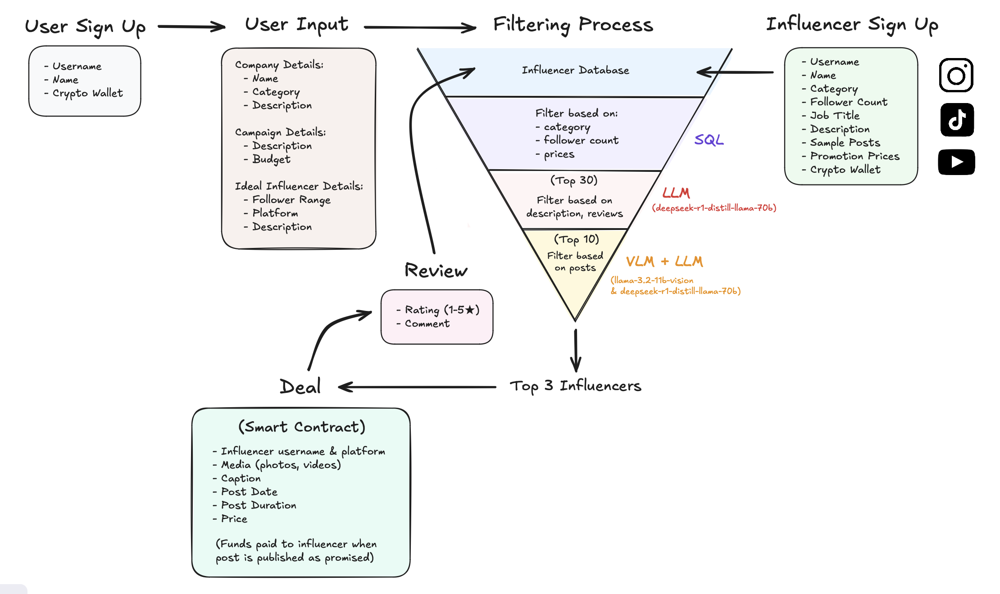

# Matchfluence – Where Brands and Influencers Connect

## What is it?

Matchfluence is a platform that uses an AI agent to help brands find influencers for effective marketing. Companies enter their details (e.g. name, category, description), describe their campaigns (e.g. budget, product description, images), and list the qualities they are looking for in influencers (follower count, platform, description). Then, the system uses both SQL and AI (reasoning LLMs and VLMs) to identify the top most suitable influencers. Deals are then made through smart contracts to ensure transparency and eliminate the need for middlemen.

## Why is Matchfluence useful?

Influencer marketing is a extremely powerful as consumers tend to purchase items from those they know, like, and trust. However, finding the right person can be a time-consuming process, especially given the vast number of users on social media platforms. Matchfluence aims to solve this problem with its AI agent, which ultimately benefits both brands and influencers.

## See it in action

You can try out the platform by visiting the website at [matchfluence.vercel.app](https://matchfluence.vercel.app/).

You can also watch a demo video of the platform at [youtu.be/KAS3P1GcjUY](https://youtu.be/KAS3P1GcjUY).

## Architecture



## Tech Stack

- **Next.js**: A modern web framework for building React applications.
- **Supabase**: An open-source PostreSQL database, used for storing information of influencers.
- **Groq**: A platform that offers fast inference for open-source LLMs. Here, it is used to run the `deepseek-r1-distill-llama-70b` reasoning model and the `llama-3.2-11b-vision-preview` vision model.
- **Vercel**: A cloud platform for deployment.

## How to run it?

To get started, clone the repository and run the following commands to install the dependencies and start the development server:

```bash
git clone https://github.com/lengvietcuong/matchfluence.git
npm install
npm run dev
```

Note that you also need to set up environment variables, which include API keys for Supasbase and Groq.

## Project Scope and Future Work

The current version of Matchfluence is a prototype that demonstrates the core functionality of the platform, namely AI influencer matching. Given the short development time of only a few days, there are several features that are not yet implemented, including:

- **User Authentication**: Brands and influencers should be able to create accounts on the platform.
- **Reviews**: Brands should be able to rate influencers after doing business with them.
- **Payment System**: Smart contracts should be implemented to facilitate transactions.

## Acknowledgements

The influencer database used in this project was obtained by scraping [collabstr.com](https://collabstr.com/).